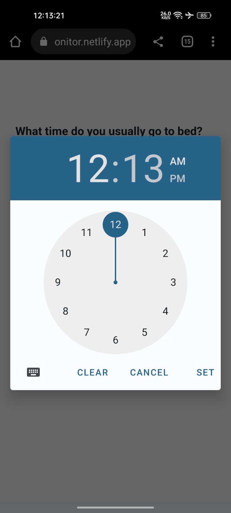
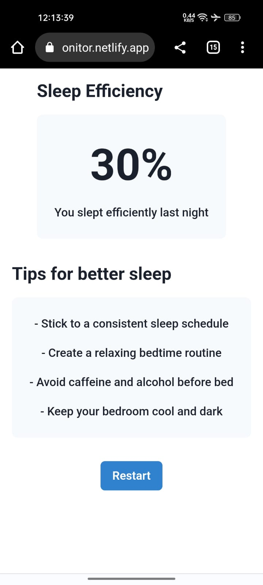

# Sleep Efficiency Tracker
## Overview
This project is a simple sleep efficiency tracker that helps you monitor your sleep patterns and make adjustments to improve the quality of your sleep. The tracker calculates your sleep efficiency based on the time you spend in bed versus the time you spend actually sleeping.

### REST API Link- https://sleep-efficiency.cyclic.app

### Deployed Link -https://sleep-monitor.netlify.app/


## Tech Stack
```
React
Chakra-UI
MongoDB
Express
```

## Features 
```
- If you are first time calculate your sleep efficiency then It will create a new account 
- If you second time login then It will update your data
- User Password are stored in after hashed  
```

## Backend API
```
- Here I am using one end point 
on that itself I am updating and storing 
```

## Screenshots
### Screen 1 


### Screen 2 


### Screen 3 


### Screen 4 


### Screen 5 
 


# Thank you 🙏